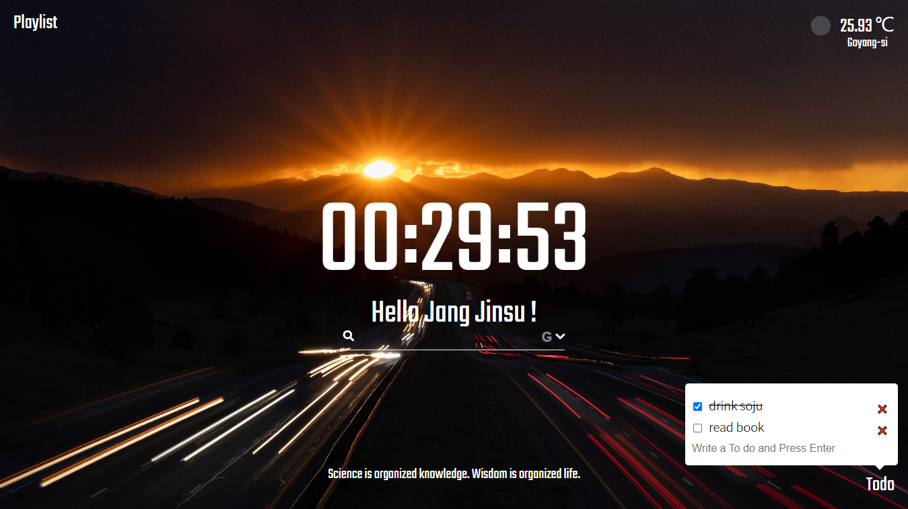

# Momentum-Clone
[Momentum](https://momentumdash.com/) `Chrome 확장프로그램`으로 유명한 Todo List를 클론코딩하였습니다.

## Introduce
> **Momentum-Clone**은 [Momentum](https://momentumdash.com/)이라는 `Chrome 확장프로그램`을 클론코딩한 사이트입니다. `HTML`과 `CSS`, `Javascript`로 작성되었으며 `localStorage`를
활용하여 Todo List를 새고고침을 하여도 유지할 수 있도록 만들었습니다. 가운데에는 현재 시간과 `구글`과 `네이버` 검색을 사용할 수 있는 검색창이 있고 배경화면은 페이지가 새로고침될 때마다
새로운 배경화면을 가지고오며 페이지 하단에는 동일하게 새로고침 될 때마다 명언이 랜덤하게 나오며 마우스 `hover`시 보입니다. 그리고 페이지 왼쪽 상단에는 플레이리스트를 구현하였고 페이지
우측상단에는 현재 위치와 날씨정보를 나타내줍니다.

[Momentum-Clone](https://huketo.github.io/momentum-clone/) 바로가기

## Images

## Nomad Coder Challenges

[노마드코더](https://nomadcoders.co/javascript-for-beginners) `바닐라JS` 크롬앱 만들기 강의를 들으면서 다른 수강생들과 매주 주어지는 과제와 최종 결과물을 만들어내는 챌린지를 통해서
집중도 있는 공부를 했습니다. 다른 수강생들과 `Slack`을 통해서 서로 모르는 것에 대해서 공유하면서 알찬 공부를 할 수 있어서 좋았습니다.

🎉 노마드코더 바닐라JS 챌린지 15기 우수작 당선 (naruto1458) 🎉 [바로가기](https://nomadcoders.co/community/thread/1131)
